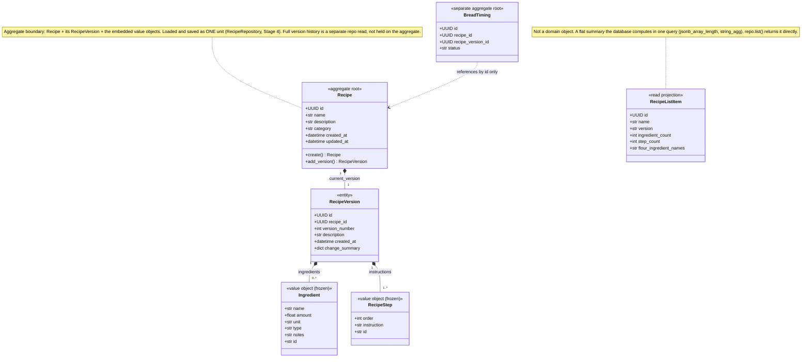
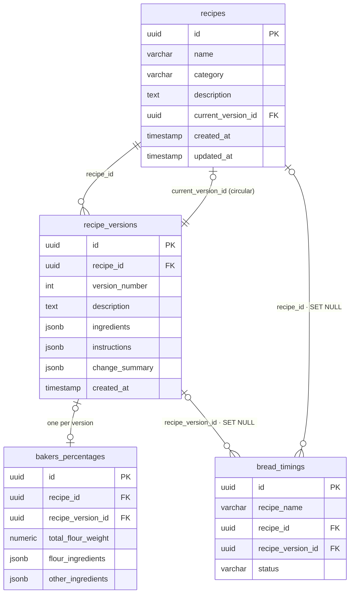
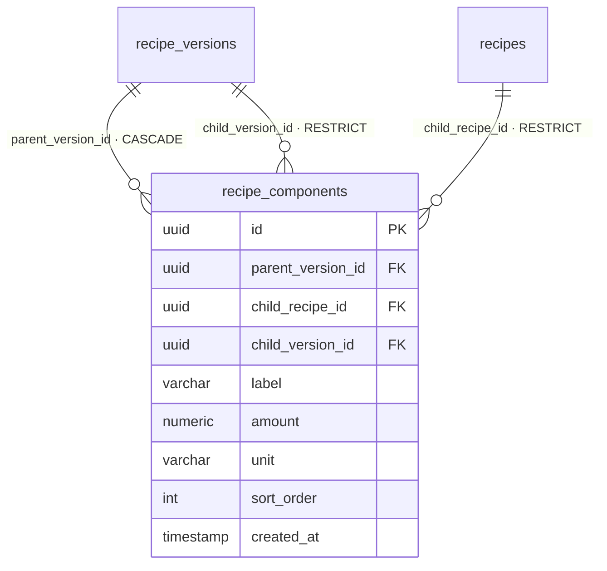

# Domain Model

DDD view of the recipe domain — entities, the aggregate boundary, and value
objects — plus the database ERD it maps to. Companion to `glossary.md`.

Status: as of Stage 3. Part II additions shown separately at the bottom.

---

## Current domain model (`backend/domain/models.py`)

`*--` (filled diamond) = composition: the part has no independent lifecycle and
is owned by the whole. `..>` = the timing merely references a recipe by id.
Fields typed `str` / `dict` above are `Optional` in the code where shown with `?`
in the glossary — Mermaid drops the `?`.

**No `RecipeHistory` type.** Version history is a repository query —
`RecipeRepository.get_versions(recipe_id) -> list[RecipeVersion]`, ordered by
`created_at` — not an object on the aggregate. The aggregate hydrates only the
current version (+ the Draft, in Part II). "Recipe specification" is a synonym
for `RecipeVersion` you may see in design notes.

### Why each class is what it is

| Class | Kind | Reason |
|---|---|---|
| `Recipe` | aggregate root, entity | UUID identity that persists; mutable; the consistency + transaction boundary |
| `RecipeVersion` | entity | own UUID identity; a distinct thing pointed at by `current_version_id` and by timings' `recipe_version_id` |
| `Ingredient` | value object (`frozen=True`) | fully defined by its attributes ("1000 g bread flour"); no identity; change = new value |
| `RecipeStep` | value object (`frozen=True`) | defined by `order` + `instruction`; the optional `id` is a soft diff-matching key, not identity |
| `RecipeListItem` | DTO / read model | DB-computed projection; never mutated, no invariants — pure query side |
| `BreadTiming` | separate aggregate | own root; its invariants (timestamp ordering, status) are unrelated to a recipe's |

---

## Database ERD

- `Ingredient[]` / `RecipeStep[]` are **not tables** — they live in the
  `recipe_versions` JSONB columns (`{"ingredients": [...]}`, `{"instructions": [...]}`).
- `bakers_percentages` is a table but **not part of the domain aggregate**; the
  mapper passes it to `recipe_to_dto` as an argument.
- The circular FK (`recipes.current_version_id` ↔ `recipe_versions.recipe_id`)
  is why inserts are staged (insert recipe → insert version → set pointer).

---

## Part II additions (target — not built yet)

New table:

