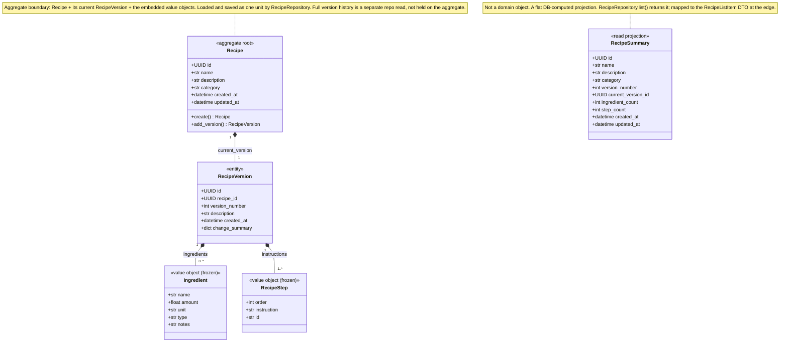
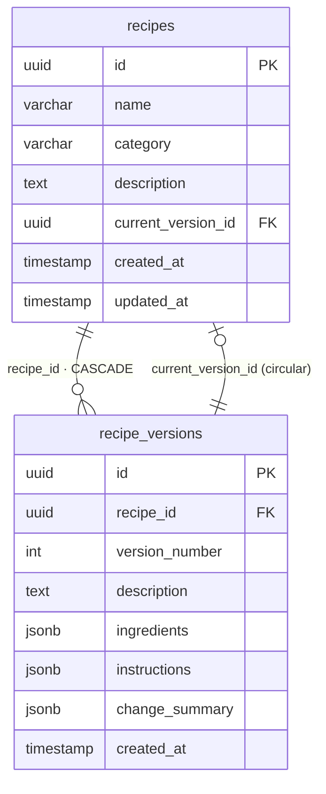
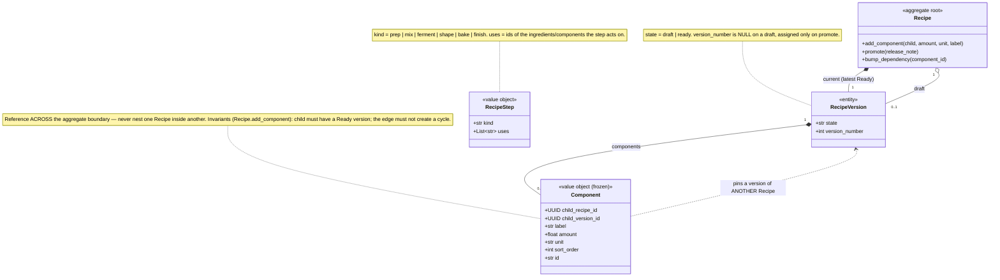
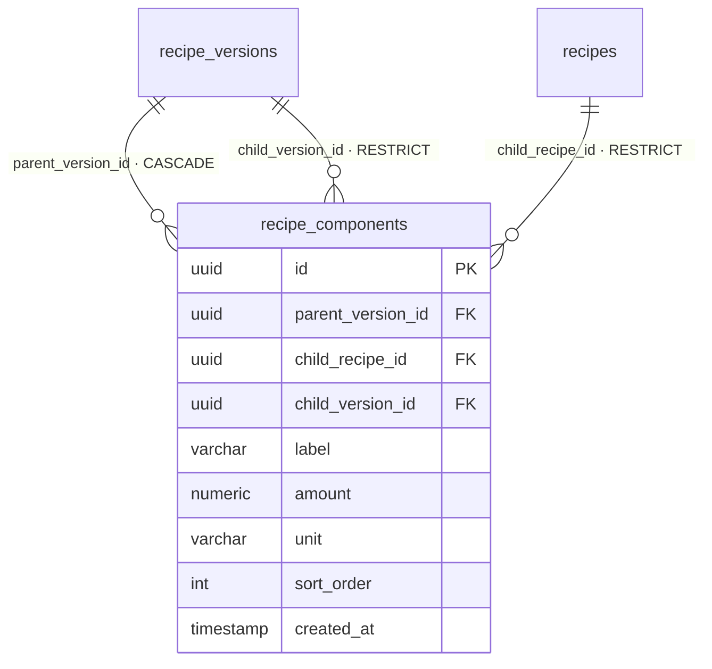

# Domain Model

DDD view of the recipe domain — entities, the aggregate boundary, and value
objects — plus the database ERD it maps to. Companion to `glossary.md`.

Status: as of Stage 4. Part II additions shown separately at the bottom.

As of Stage 4 this model is **live on the recipe path**: `RecipeRepository`
loads and saves `Recipe` aggregates, `RecipeService` operates on domain objects,
and the `api/` mappers convert to/from DTOs at the HTTP edge. Recipe SQL no
longer lives in `DBConnector`.

---

## Current domain model (`backend/domain/models.py`)

`*--` (filled diamond) = composition: the part has no independent lifecycle and
is owned by the whole.

**No `RecipeHistory` type.** Version history is a repository query —
`RecipeRepository.get_versions(recipe_id) -> list[RecipeVersion]`, ordered by
`version_number` descending — not an object on the aggregate. The aggregate
hydrates only the current version (+ the Draft, in Part II). "Recipe
specification" is a synonym for `RecipeVersion` you may see in design notes.

### Why each class is what it is

| Class | Kind | Reason |
|---|---|---|
| `Recipe` | aggregate root, entity | UUID identity that persists; mutable; the consistency + transaction boundary |
| `RecipeVersion` | entity | own UUID identity; a distinct thing pointed at by `recipes.current_version_id` (and, later, by component pins) |
| `Ingredient` | value object (`frozen=True`) | fully defined by its attributes ("1000 g bread flour"); no identity, no id field; diffed by name; change = new value |
| `RecipeStep` | value object (`frozen=True`) | defined by `order` + `instruction`; the optional `id` is a soft diff-matching key, not identity |
| `RecipeSummary` | read model | DB-computed projection; never mutated, no invariants — pure query side |

---

## Database ERD

- `Ingredient[]` / `RecipeStep[]` are **not tables** — they live in the
  `recipe_versions` JSONB columns (`{"ingredients": [...]}`, `{"instructions": [...]}`).
- `change_summary` holds machine-generated diff counts for UI display; written
  by `RecipeRepository.save()`, left null on the first version.
- The circular FK (`recipes.current_version_id` → `recipe_versions.id`, and
  `recipe_versions.recipe_id` → `recipes.id`) is why inserts are staged
  (insert recipe → insert version → set the current pointer).

---

## Part II additions (target — not built yet)

New table:

