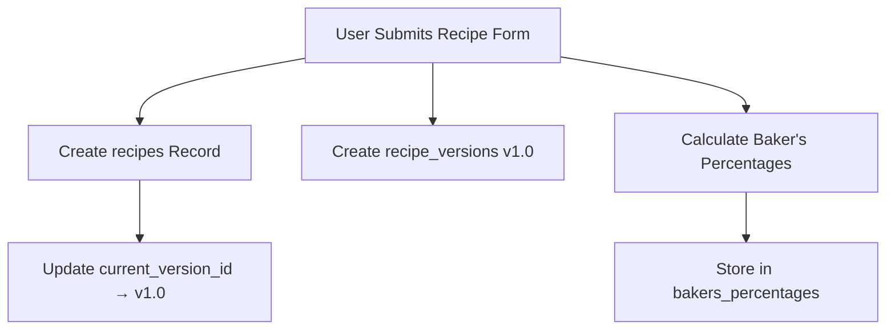

# Recipe System Architecture

This document explains the relationship between recipe-related tables and the recipe creation workflow in the bread-log application.

## Table Relationships

### 1. `recipes` Table (Main Recipe)
- **Purpose**: Stores the basic recipe metadata
- **Key Fields**: 
  - `id` (UUID) - Primary key
  - `name` - Recipe name (e.g., "Sourdough Bread")
  - `description` - Optional recipe description
  - `category` - Recipe category (e.g., "bread", "pastry")
  - `current_version_id` (UUID) - Points to the latest active version
  - `created_at`, `updated_at` - Timestamps

### 2. `recipe_versions` Table (Version Control)
- **Purpose**: Stores actual recipe content with versioning system
- **Key Fields**:
  - `id` (UUID) - Primary key
  - `recipe_id` (UUID) - Foreign key linking back to main recipe
  - `version_major`, `version_minor` - Version numbers (e.g., 1.2, 2.0)
  - `ingredients` (JSON) - Array of ingredient objects
  - `instructions` (JSON) - Array of instruction steps
  - `description` - Version-specific description
  - `created_at` - When this version was created
  - `change_summary` (JSON) - What changed in this version

### 3. `bakers_percentages` Table (Calculated Values)
- **Purpose**: Stores automatically calculated baker's percentages
- **Key Fields**:
  - `total_flour_weight` - Sum of all flour ingredients
  - `flour_ingredients` (JSON) - Flour breakdown
  - `other_ingredients` (JSON) - Non-flour ingredients with percentages

## Recipe Creation Workflow

### When a User Creates a Recipe in the Recipe Tab:



### Step-by-Step Process:

1. **Create Main Recipe Record** (`recipes` table):
   ```sql
   INSERT INTO recipes (name, description, category, created_at, updated_at)
   VALUES ('Sourdough Bread', 'Classic sourdough', 'bread', NOW(), NOW())
   RETURNING id;
   ```

2. **Create First Version** (`recipe_versions` table):
   ```sql
   INSERT INTO recipe_versions (recipe_id, version_major, version_minor, ingredients, instructions)
   VALUES (recipe_id, 1, 0, ingredients_json, instructions_json)
   RETURNING id;
   ```

3. **Calculate Baker's Percentages**:
   - Parse ingredients JSON to find flour types
   - Calculate total flour weight
   - Calculate percentage of each ingredient relative to total flour
   - Store results in `bakers_percentages` table

4. **Link Current Version**:
   ```sql
   UPDATE recipes SET current_version_id = new_version_id
   WHERE id = recipe_id;
   ```

## Data Models

### Ingredient Structure
```typescript
interface Ingredient {
  id?: string;
  name: string;        // "Bread Flour"
  amount: number;      // 500
  unit: string;        // "grams"
  type: string;        // "flour", "liquid", "preferment", "other"
  notes?: string;      // Optional notes
}
```

### Recipe Step Structure
```typescript
interface RecipeStep {
  id?: string;
  order: number;       // 1, 2, 3...
  instruction: string; // "Mix flour and water..."
}
```

### Baker's Percentages Example
```json
{
  "total_flour_weight": 500,
  "flour_ingredients": [
    {"name": "Bread Flour", "weight": 400, "percentage": 80},
    {"name": "Whole Wheat", "weight": 100, "percentage": 20}
  ],
  "other_ingredients": [
    {"name": "Water", "weight": 350, "percentage": 70},
    {"name": "Salt", "weight": 10, "percentage": 2}
  ]
}
```

## Relationship Diagram

```
recipes (1) ←→ (many) recipe_versions
    ↓
current_version_id points to → recipe_versions.id
                              ↓
                         bakers_percentages (calculated from ingredients)
```

## Versioning Benefits

- **Version Control**: Track changes to recipes over time (v1.0 → v1.1 → v2.0)
- **Baker's Percentages**: Automatically calculate proper bread ratios
- **Current Version**: Always know which version is "live"
- **History**: Keep old versions for comparison/rollback
- **Change Tracking**: See what changed between versions

## Integration with Timing System

When a user selects a recipe in the Timing tab:

1. Recipe name appears in the bread dropdown with "(Recipe)" label
2. Recipe preview shows full ingredients and instructions
3. Timing entries reference the recipe name for consistency
4. No separate "makes" table needed - recipe names flow naturally into timing

This design allows recipes to integrate seamlessly with the timing/logging system while maintaining full version control and baker's percentage calculations.

## Recipe Editing Requirements

### Current Issue
The current implementation lacks proper recipe viewing and editing functionality that joins information across all 3 tables (recipes, recipe_versions, bakers_percentages).

### Recipe Editing Workflow Requirements

#### Frontend Requirements:
1. **Recipe ID Storage**: Frontend should store the recipe ID in local cache for the recipe being edited
2. **Request Format**: Should use PATCH request to `/recipes/{recipe_id}`
3. **Request Body**: Should use the same complete JSON body structure as POST creation (full recipe data, not just changed fields)

#### Backend Processing Requirements:
1. **Version Management**: 
   - Increment the version **major** number (e.g., 1.0 → 2.0, not 1.1)
   - Create new entry in `recipe_versions` table
2. **Recipe Table Updates**:
   - Update `current_version_id` to point to the new version
   - Update `updated_at` field with current timestamp  
3. **Baker's Percentages**:
   - Recalculate baker's percentages if any flour ingredient or other ingredient quantities have changed
   - Update or create new entry in `bakers_percentages` table

#### PATCH Request Flow:
```mermaid
graph TD
    A[PATCH /recipes/{recipe_id}] --> B[Get Current Recipe Data]
    B --> C[Create New Version Record v2.0]
    C --> D[Check if Ingredients Changed]
    D --> E[Recalculate Baker's Percentages]
    E --> F[Update current_version_id]
    F --> G[Update updated_at timestamp]
    G --> H[Return Updated Recipe]
```

#### API Specification:
```
PATCH /recipes/{recipe_id}
Content-Type: application/json

Body: Same as POST /recipes/ (complete recipe data)
{
  "name": "Updated Recipe Name",
  "description": "Updated description", 
  "category": "bread",
  "ingredients": [...],
  "instructions": [...]
}

Response: Complete recipe object with new version information
```

#### Database Operations for Recipe Edit:
1. **Insert New Version**:
   ```sql
   INSERT INTO recipe_versions (recipe_id, version_major, version_minor, ingredients, instructions, description, created_at)
   VALUES (recipe_id, current_major + 1, 0, new_ingredients, new_instructions, new_description, NOW())
   RETURNING id;
   ```

2. **Update Recipe Metadata**:
   ```sql
   UPDATE recipes 
   SET name = new_name, description = new_description, category = new_category,
       current_version_id = new_version_id, updated_at = NOW()
   WHERE id = recipe_id;
   ```

3. **Recalculate Baker's Percentages** (if ingredients changed):
   ```sql
   UPDATE bakers_percentages 
   SET total_flour_weight = new_total, flour_ingredients = new_flour_data, 
       other_ingredients = new_other_data
   WHERE recipe_version_id = new_version_id;
   ```

This ensures full version control with automatic percentage recalculation for any recipe modifications.